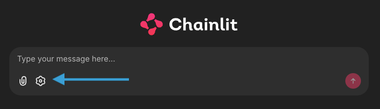

# AI Agents in Action: Building Smart, Open-Source LLM-based Workflows

Welcome to the official repository for the AI Agents Workshop! This guide will walk you through setting up your environment and running the exercises.

## Getting Started

Follow these steps to get everything up and running.

### 1. Install `uv`

This project uses `uv`, a fast Python package and project manager. If you don't have it installed, you can use `pip`:

```bash
pip install uv
```

For other installation methods, see the [official `uv` documentation](https://docs.astral.sh/uv/getting-started/installation/).

### 2. Install Dependencies

Once `uv` is installed, sync the project dependencies:

```bash
uv sync
```

This command installs all the necessary packages listed in the `uv.lock` file.

## Running the Application

You have two options for running the application:

1.  **Using the Command Line:**
    Run the following command in your terminal at the project root:

    ```bash
    uv run chainlit run aia25/app.py -w -h
    ```

2.  **Using the Shorthand Command:**
    First, install the project in editable mode:
    ```bash
    uv pip install -e .
    ```
    Then, you can use the shorthand command:
    ```bash
    uv run app
    ```
    This will start the user interface.

## Tracing
You can have a look at the flow of execution, by inspecting the traces. Traces are separated by experiment, and each time you start a specific exercise, a new trace is generated.
We are using MLFlow for tracing, to launch the dashboard, just enter the following command in your CLI (ensure your virtual environment is activated):
```bash
 mlflow ui --backend-store-uri sqlite:///mlflow.db --port 5000
 ```
 This starts the MLFlow server on port 5000.
 To inspect your server just go to: http://localhost:5000/

## Repository Structure

The repository is organized into the following directories:

-   `aia25/`: Contains the core application logic and user interface, powered by Chainlit.
-   `exercise01/` to `exercise04/`: These folders contain the exercises for the workshop.
-   `solution_exercise02/` to `solution_exercise04/`: These folders contain the solutions to the corresponding exercises.
-   `images/`: Contains images used in the documentation.

## How to Use the Workshop App

1.  **Start the application** using one of the methods described above.
2.  **Select an agent** to interact with by clicking the gear icon on the left side of the chat interface.

    

3.  **Choose the agent** you want to run from the dropdown menu. Each agent corresponds to an `execute_agent` function within the `my_agents.py` file of each exercise module.

    

Now you're all set! Enjoy the workshop.
